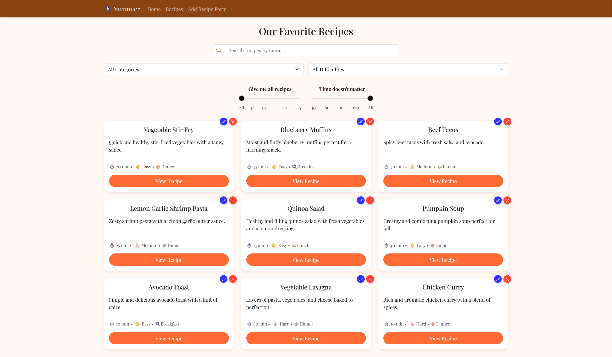
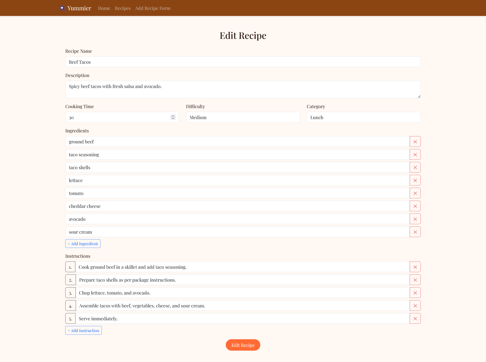

# Yummier

## So your everyday dishes get even yummier!

Yummier is a community-driven platform designed for food enthusiasts to share their favorite recipes, culinary tips, and secrets to making everyday dishes even more delicious. Whether you’re a seasoned chef or a home cook, Yummier offers a space to explore, share, and inspire in the kitchen.

---

## Table of Contents

- [Features](#features)
- [Installation](#installation)
- [Usage](#usage)
- [Screenshots](#screenshots)
- [Tech Stack](#tech-stack)
- [License](#license)
- [Contact](#contact)

---

## Features

- **Browse Recipes:** Discover a diverse collection of recipes contributed by fellow food lovers.
- **Step-by-Step Instructions:** Follow detailed guides with visuals to create perfect dishes.
- **Review & Rate:** Leave feedback and ratings on recipes you’ve tried.
- **Add New Recipes:** Share your personal culinary creations with an easy-to-use submission form.
- **Edit Recipes:** Update or improve your existing recipes at any time.
- **User-Friendly Interface:** Enjoy a clean, intuitive design that makes navigating recipes a breeze.

---

## Installation

To get started with Yummier locally, follow these steps:

1. **Clone the Repository**
   ```bash
   git clone https://github.com/yourusername/yummier.git
   cd yummier
   ```
2. **Build docker container**
   ```bash
   docker compose up --build
   ```

Open your browser and navigate to http://localhost to see Yummier in action.

---

## Usage

- Browse Recipes: On the homepage, explore the recipe list and click on any recipe for full details.
- Follow a Recipe: Each recipe page provides a step-by-step guide to help you create the dish perfectly.
- Add a Recipe: Click the "Add Recipe" button to share your culinary masterpiece with the community.
- Edit a Recipe: If you are the author, you can update your recipe using the "Edit Recipe" feature.

---

## Screenshots






---

## Tech stack

Yummier is built using modern technologies, such as:

_Frontend_

[](https://developer.mozilla.org/en-US/docs/Web/HTML) [](https://developer.mozilla.org/en-US/docs/Web/CSS) [](https://www.typescriptlang.org) [](https://www.typescriptlang.org) 

_Backend_

[](https://kotlinlang.org) [](https://spring.io/projects/spring-boot)

_Databases_

[](https://www.postgresql.org)

--- 

## License

Yummier is open source and available under the [MIT License](LICENSE).

---

## Contact

Have questions or suggestions? 
Feel free to open an issue or contact us directly at bartlomiej.treska@gmail.com or michalryz2003@gmail.com